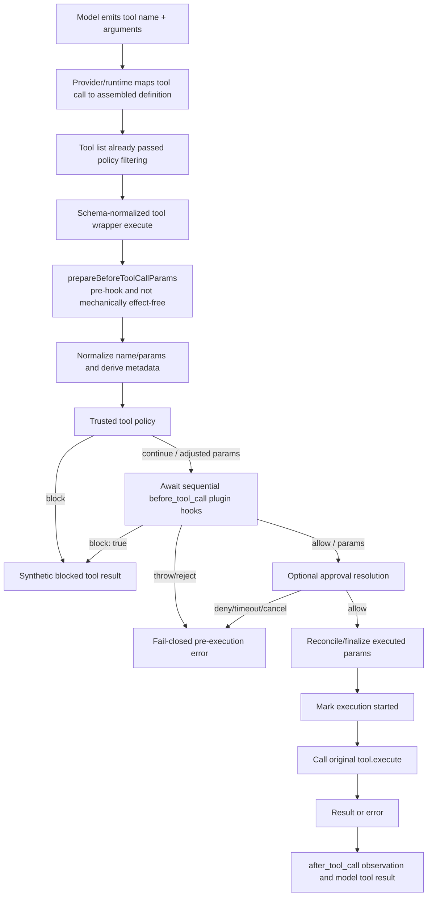

# OpenClaw tool-call lifecycle

This lifecycle is **confirmed from the installed compiled OpenClaw 2026.6.10 build, commit `aa69b12d0086b631b139c1435c9621a5783e3a40`**. It has not yet been experimentally exercised with the prepared probe. Current-upstream commit `4a675228` was used only for comparison.

## Lifecycle diagram



The enforcement point is after model generation and tool selection, but before the captured `tool.execute`. Optional `prepareBeforeToolCallParams` code runs before it, so pilot tools must omit that callback or have it separately audited. The hook is not between the tool implementation and operating-system syscalls.

## Construction path

1. `src/agents/agent-tools.ts` calls `createOpenClawTools(...)`, which collects core and plugin tools.
2. It applies provider, global, agent, group, sender, sandbox, owner, subagent, and inherited tool policies through `applyToolPolicyPipeline` in `src/agents/tool-policy-pipeline.ts`.
3. It normalizes tool JSON schemas.
4. It maps every authorized tool through `wrapToolWithBeforeToolCallHook` (or rewraps an already wrapped definition) at installed `dist/agent-tools-XUrUI5bQ.js:3042-3077`.
5. It adds an outer abort wrapper and returns the definitions to the model runtime.

`createOpenClawTools` also has a `wrapBeforeToolCallHook: false` option. The main assembly path deliberately uses that option and then applies one final common wrapper itself, preventing double wrapping (`src/agents/agent-tools.ts:980-1174`). This is safe only because that caller performs the later shared wrapping.

## Invocation path and exact functions

| Stage | File/function | Behavior |
|---|---|---|
| Wrapper entry | installed `dist/agent-tools.before-tool-call-CDuA0_mC.js` — `wrapToolWithBeforeToolCallHook` | Replaces the definition's `execute` with an async wrapper while retaining original `execute` |
| Normalize/metadata | same installed bundle — `normalizeCodeModeExecBeforeHookParams`, `deriveToolParams` | Produces hook input and best-effort derived paths |
| Policy/hook orchestration | same installed bundle — `runBeforeToolCallHook` | Runs core/trusted policy, plugin hooks, approvals and loop checks |
| Plugin dispatch | installed `dist/hook-runner-global-Bm5WihiA.js` — `runBeforeToolCall` | Awaits handlers sequentially; sticky block; last applicable params |
| Failure policy | same installed bundle — `initializeGlobalHookRunner` | Sets `before_tool_call` failure policy to `fail-closed` |
| Veto result | wrapper — `buildBlockedToolResult` | Returns a normal synthetic blocked result without calling original execute |
| Mutation boundary | installed wrapper after awaited outcome | Reconciles/finalizes params, then invokes original execute; unlike current upstream it has no intervening explicit abort check |
| Post observation | plugin hook runner — `runAfterToolCall` | Observes result/error after execution; not an enforcement point |

## Result semantics

The basic hook is not an `ALLOW | DENY` enum:

```ts
// allow unchanged
return;

// allow with replacement/patch parameters
return { params: { ...event.params, key: "value" } };

// deny cleanly before execute
return { block: true, blockReason: "policy denied" };
```

Promise-returning handlers are awaited. Registered handlers run sequentially within a call. Distinct parallel tool calls may dispatch their hook chains concurrently.

## Surface notes

- Core and plugin tools in the normal embedded agent assembly share the final wrapper.
- Shell execution is one such tool; the hook sees the command request, not each child syscall.
- OpenClaw's installed plugin-tools MCP handler explicitly wraps/rewraps tools (`dist/mcp/plugin-tools-serve.js`). This does not prove all external MCP clients/adapters use that handler.
- Subagent control tools are wrapped in the parent. A child agent is a new run whose own assembled tool list should be wrapped, but installed plugin propagation remains an experimental question.
- Background activity already started by an allowed tool is outside later hook calls.
- Retries that reinvoke a wrapped definition should re-run the hook; provider/harness replay behavior requires an installed-runtime test.
- Installed HTTP `POST /tools/invoke` resolves gateway-scoped tools with wrapping disabled, then explicitly awaits the same `runBeforeToolCallHook` orchestration before calling the resolved `execute`; its deterministic correlation ID is `http-<idempotencyKey>`.

## Evidence still needed

The following remains unresolved after installed-build inspection:

- effective plugin/tool entries in the unreadable `/home/invaros/.openclaw/openclaw.json`;
- exact native/MCP tools exposed to the pilot model;
- installed behavior under DENY, delay, hook rejection, cancellation, retry and concurrency;
- whether any installed harness has a release-specific relay/bypass defect.

No live tool call was made during this phase. Installed build metadata, service configuration and compiled ordering are observed; behavioral claims still require the review-only probe.
